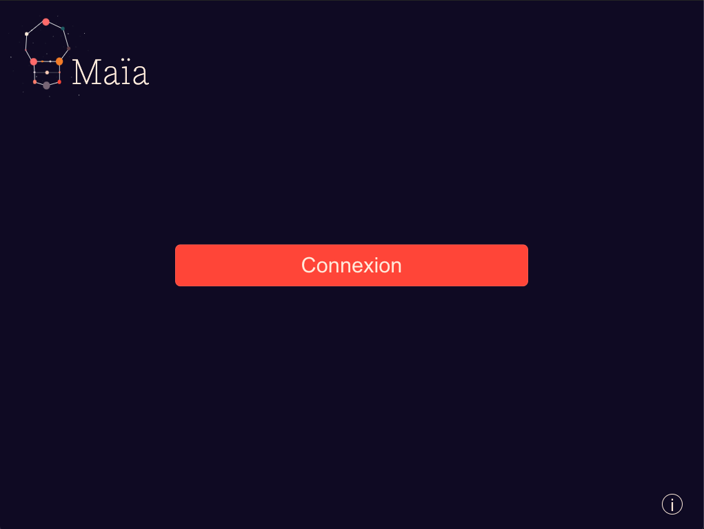
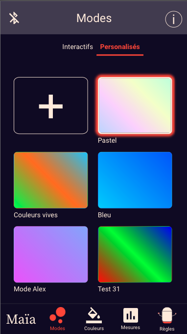

Note : il n'y a pas de version en français de ce document (du moins pour l'instant, n'hésitez pas à nous contacter si vous avez besoin d'aide à propos du contenu de ce document !)

# Maïa, the application

Welcome!
This repository contains all the code we put together to build the application that allows you to control a Maïa mood lamp! Maïa is a lamp that can be assembled with very few (and cheap) components, 3D printed parts, and controlled remotely from your phone or computer using bluetooth!

If you already have a lamp, get the app [here](XXXXXXX) now! 
If you wish to build your own lamp, check out the other sections of [this repository] (XXXX).

Structure of the app
------------------------

This app is built using React in association with Redux. It is a Progressive Web App (PWA). 
It therefore has a desktop version (minimal screen size targeted of 1024 x 768), and a mobile version (minimal screen size targeted 360 x 640).

Because it relies on web bluetooth to communicate with the lamp, the app only runs on Chrome for Android and desktop (no other browser supports web bluetooth, and CHrome for iOS neither).

The following graph shows how the app is structured showing its main components. If you want to be able to look at it bigger, it is available [here](XXXXXXX).

The app relies on a few dependencies: 

- iro color picker (^5.2.3)
- react-tabs (^3.1.1)
- react-spinners-css (^1.2.2)
- react-time-picker (^4.0.1)
- react-redux (^7.2.2)
- (redux-thunk (^2.3.0) not currently used - no middleware)

Features
------------------------

The application is composed of four menus. Below is a description of what each menu allows the user to do.

### Home

For now the Home is used only to display the "Connect" button upon launching the app, and prior to being connected to a lamp. In the future it will probably be used to add the OTA UI elements, and will be accessible by clicking on the Maia logo.

     

          

The about menu is available at all times. 

### Modes

This menu is divided into two tabs: the tab of the preconfigured modes (called "Interactifs"), and the tab of the user defined modes (called "Personalisés"). The currently executed mode can be identified with the thick border around the tile.

##### The preconfigured modes

These modes are defined on the microcontroller, and can be updated by flashing a new version of the firmware. 

None of these modes can be deleted from the microcontroller. While some them are absolutely not editable, it is possible to choose different colors for many of them if you do not like the color palette. 

If a mode cannot be edited, when hovering (or hold touch), no icon appears below the tile.

If a mode can be edited, a modal window opens with the settings of the mode. However, neither the name nor the animation speed can be edited, and in some cases, the number of colors is fixed. 

##### The user defined modes

The user can define custom modes by setting a color palette, and an animation speed. The mode that will be executed is a animated gradient that will go through the color palette randomly. 

When hovering a mode, two icons appear to edit or delete the mode. 

The user can edit everything on the mode, the name, the colors (up to 10) and the speed.

 

##### Editing a mode

Note that as soon as a mode is being set to edit mode (i.e. the user clicked on the edit icon or tapped the Edit button), the mode is automatically executed by the microcontroller. This allows the user to visualize the changes live. 
The updates are sent to the microcontroller every 500ms (debouncing). 

A warning message will be displayed if the user quits the edit window without clicking on "Save".

##### Deleting a mode

Only the user defined modes can be deleted. This action is irreversible.

### Colors

This menu displays a color picker. It is possible to select a color, or a color palette with a speed, without ever saving it. The lamp will execute this unsaved mode until it is turned OFF (or unplugged). 

A user can select up to 10 colors. When executing this mode, the lamp will animate a gradient that goes through the color palette randomly.

The user can save the current setting of the mode as a new user-defined mode. 

Upon saving it, it will appear at the top of the list of user-defined modes.

### Readings

This menu displays the current values measured by the sensors. Currently, only one of the sensors sends its measures, but in the future other measurements could be displayed as well. 

### Rules

This menu lists all the automation rules available. 

Let's go through each rule :

1. "Laisser la lampe choisir automatiquement le mode actif" --> the lamp automatically chooses which mode to execute depending on the moment. For example, if it is 9pm, it can set a relaxing mode. Or on Dec, 25th execute the Christmas mode.
2. "Désactiver les automatismes si aucun son pendant plus de X heures" --> the lamp will automatically turn off the rules of auto ON/auto OFF if no sound is heard for more than X hours. This can be useful when going on holidays for example.
3. "Allumage automatique / Extinction automatique" --> these two sections are built the same way, one to manage the automatique turn ON, the other the turn OFF. Two options are available for each of these :
	a. based on the light level, with the possibility to set a time after which the light level should be checked
	b. at a fixed time, with the possibility to set a time from which the light will start dimming prior to this time

Any change on this page is automatically saved to the microcontroller.

Mobile version screenshots
----------------------------

All that was described above with screenshots from the desktop version applies to the mobile version as well. Here are the corresponding screenshots.

#### Home and about

     

---

#### Modes menu

**Preconfigured modes**

     
  

 

**Custom modes**

	
	     
	

    
   

**Discard changes**

 

---

#### Colors menu

     

---

#### Readings menu

---

#### Rules menu

Further work and contact
----------------------------

Here are some of the improvements that we are thinking about:

- support other languages on the application (currently only available in French)
- add support for OTA
- add options for the user to select an animation template for the user defined modes (currently it is always going to be an animated gradient that goes randomly through the color palette)
- add categories to the modes to organize better the lists 
- add options for rules
	- possibility to enable automatic turn on based on a noise (some ML to implement)
	- handle user inputs with warnings when the values are not good
	- hours as well as minutes for the time before turning off the automatisms if no noise heard
- add timeseries graphs to the readings menu instead of an instantaneous reading only
- implement an iOS application (web bluetooth supported only on Chrome for desktop and Android)

Also, don't hesitate to get in touch with us, if you liked this project, if you would like to suggest improvements or contribute!
We are [Alexina Coullandreau](https://www.acoullandreau.com) and [Gustavo Buzogany Eboli](https://www.gbuzogany.com)
